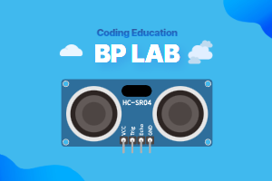

# Ultrasonic Extension for MakeCode



This extension allows you to measure distances using an ultrasonic sensor with the micro:bit.

## 🚀 Features

- Easy distance measurement using ultrasonic sensors
- Support for multiple measurement units (microseconds, centimeters, inches)
- Configurable maximum distance measurement
- Simple block interface for easy integration
- Can be registered as a MakeCode extension for easy use

## Blocks

### 🔍 Summary: What each block does

| **Block ID**                 | **Function**                                   |
|-----------------------------|-----------------------------------------------|
| [`ping`](#ping-measurement-block) | Measure distance using ultrasonic sensor |

### Ping Measurement Block

```typescript
//% blockId=sonar_ping block="ping trig %trig|echo %echo|unit %unit"
export function ping(trig: DigitalPin, echo: DigitalPin, unit: PingUnit, maxCmDistance = 500): number
```

- 🔹 Description
  - Measures the distance to an object using an ultrasonic sensor
  - Supports different measurement units:
    - Microseconds (μs)
    - Centimeters (cm)
    - Inches (inches)
  - Default maximum distance is 500cm

- 🔹 Parameters
  - `trig`: Trigger pin for the ultrasonic sensor
  - `echo`: Echo pin for the ultrasonic sensor
  - `unit`: Measurement unit (μs, cm, or inches)
  - `maxCmDistance`: Maximum measurable distance in centimeters (optional)

- ✅ Usage example
  ```typescript
  // Measure distance in centimeters using pins P1 and P2
  let distance = ultrasonic.ping(DigitalPin.P1, DigitalPin.P2, PingUnit.Centimeters)
  
  // Measure distance in inches with custom maximum distance
  let inches = ultrasonic.ping(DigitalPin.P1, DigitalPin.P2, PingUnit.Inches, 300)
  ```

## 🔧 How it works

The ultrasonic sensor sends out a pulse and measures the time it takes for the echo to return:
1. Trigger pin sends a 10μs pulse
2. Echo pin measures the return time
3. Distance is calculated based on the selected unit:
   - Centimeters = echo time / 58
   - Inches = echo time / 148
   - Microseconds = raw echo time

---

> Open this page at [https://bplab-dev.github.io/pxt-bplab-ultrasonic/](https://bplab-dev.github.io/pxt-bplab-ultrasonic/)

## Use as Extension

This repository can be added as an **extension** in MakeCode.

* open [https://makecode.microbit.org/](https://makecode.microbit.org/)
* click on **New Project**
* click on **Extensions** under the gearwheel menu
* search for **https://github.com/bplab-dev/pxt-bplab-ultrasonic** and import

## Edit this project

To edit this repository in MakeCode.

* open [https://makecode.microbit.org/](https://makecode.microbit.org/)
* click on **Import** then click on **Import URL**
* paste **https://github.com/bplab-dev/pxt-bplab-ultrasonic** and click import

#### Supported targets

* for PXT/microbit

<script src="https://makecode.com/gh-pages-embed.js"></script>
<script>makeCodeRender("{{ site.makecode.home_url }}", "{{ site.github.owner_name }}/{{ site.github.repository_name }}");</script>
